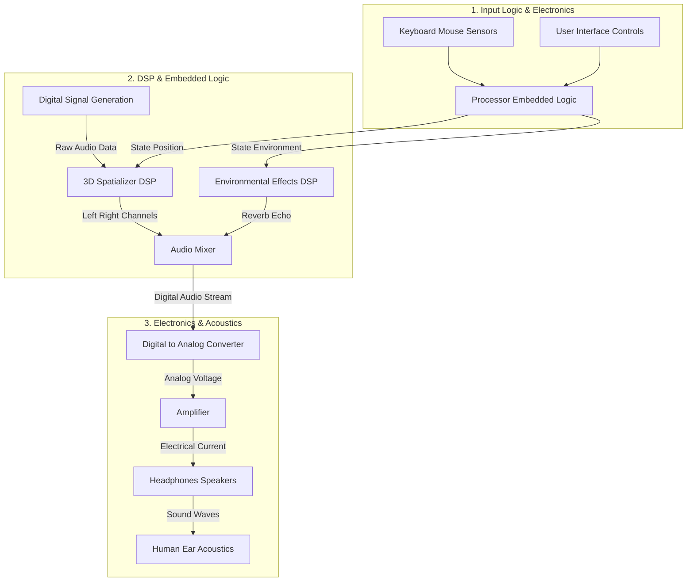

# System Design: Single-User 3D Audio Experience

This document outlines the detailed system architecture for a **Single-User 3D Spatial Audio System**. It breaks down how the audio experience is created, processed, and delivered to your ears, incorporating elements of Digital Signal Processing (DSP), Electronics, Embedded Systems, and Acoustics.

## 1. System Overview

The system is designed for **one user** to navigate a virtual 3D environment. As the user moves and looks around, the system dynamically alters the sound properties (volume, direction, tone) in real-time to simulate a realistic acoustic space.

**Goal:** Create an immersive auditory experience where sound sources (like water or animals) appear to come from specific locations in 3D space relative to the listener.

## 2. High-Level Architecture (Block Diagram)

This diagram shows the flow of data from the **Physical World** (User Input) through the **Digital Processing Layer** (The Brain) to the **Physical Output** (Sound Waves).

## 3. Detailed Component Breakdown

### A. Input Stage (Electronics & Embedded)
This stage captures the user's intent.
*   **Electronics (Sensors):** The keyboard and mouse contain electronic switches and optical sensors that convert physical movement into digital signals.
*   **Embedded Logic (The "Brain"):** The Central Processing Unit (CPU) acts as the embedded controller. It runs the software loop (the React Application) which:
    1.  Reads sensor data (e.g., "User pressed 'W'").
    2.  Calculates the new **User Position (X, Y, Z)** and **Orientation (Yaw)**.
    3.  Sends these coordinates to the DSP engine.

### B. Digital Signal Processing (DSP)
This is the core "Math" layer that shapes the sound. The Web Audio API performs specialized mathematical operations on the audio signals.
*   **Signal Generation (Oscillators):** Instead of playing back a recording, the system uses mathematical formulas to generate sound waves (Sine, Square, Noise) from scratch.
    **Example:** `Math.random()` generates White Noise for the wind.
*   **Spatialization (Panner Node):** This is the heart of 3D audio. It uses algorithms to simulate:
    *   **Interaural Level Difference (ILD):** Making sound louder in the left ear if the source is on the left.
    *   **Interaural Time Difference (ITD):** Delaying the sound slightly to the right ear if the source is on the left (since sound takes time to travel).
    *   **Head-Related Transfer Function (HRTF):** Filtering the sound to mimic how your outer ear (pinna) shapes sound coming from behind or above.
*   **Filtering (BiquadFilterNode):** Removes specific frequencies.
    *   **Low-Pass Filter:** Cuts off high-pitched sounds to simulate distance (air absorbs high frequencies) or underwater effects.

### C. Output Stage (Electronics & Acoustics)
This stage converts the processed digital numbers back into physical sound.
*   **DAC (Digital-to-Analog Converter):** The computer's sound card takes the digital stream (0s and 1s) and converts it into a continuous varying electrical voltage.
*   **Amplifier:** Boosts the small voltage from the DAC into a stronger electrical current capable of driving speakers.
*   **Speakers (Transducers):** A coil of wire inside a magnet vibrates when the electrical current flows through it. This pushes a diaphragm (cone), creating pressure waves in the air.

### D. Acoustics (The Final Frontier)
Once the sound leaves the speaker, physics takes over.
*   **Propagation:** The sound waves travel through the air to your ears.
*   **Room Acoustics:** If you are using speakers, the sound bounces off your walls (reverb), adding natural coloration.
*   **Perception:** Your brain analyzes the tiny differences in timing and volume between your two ears to construct a 3D mental map of where the "Elephant" or "Water" is located.

## 4. Summary of Data Flow

1.  **User Action** (Presses 'W') -> **Electronics** (Keyboard Sensor)
2.  **Embedded Logic** (Updates Position Variable to X+1)
3.  **DSP Engine** (Recalculates Panning: "Sound is now 5 meters behind")
4.  **DSP Processing** (Attenuates Volume via Inverse Distance Law)
5.  **Electronics** (DAC converts Math to Voltage)
6.  **Acoustics** (Speaker vibrates air -> Ear detects change)
